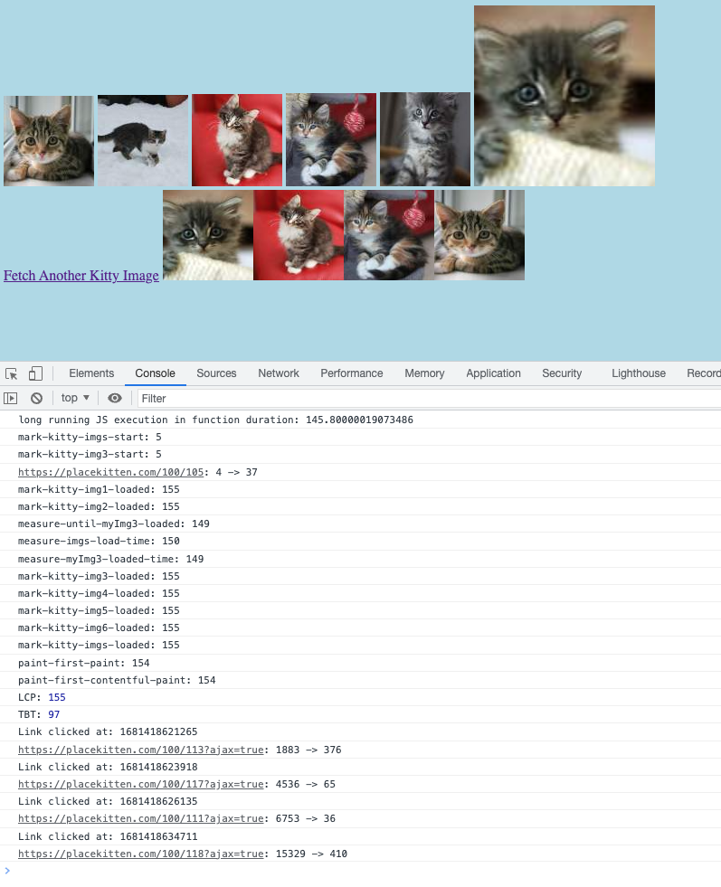
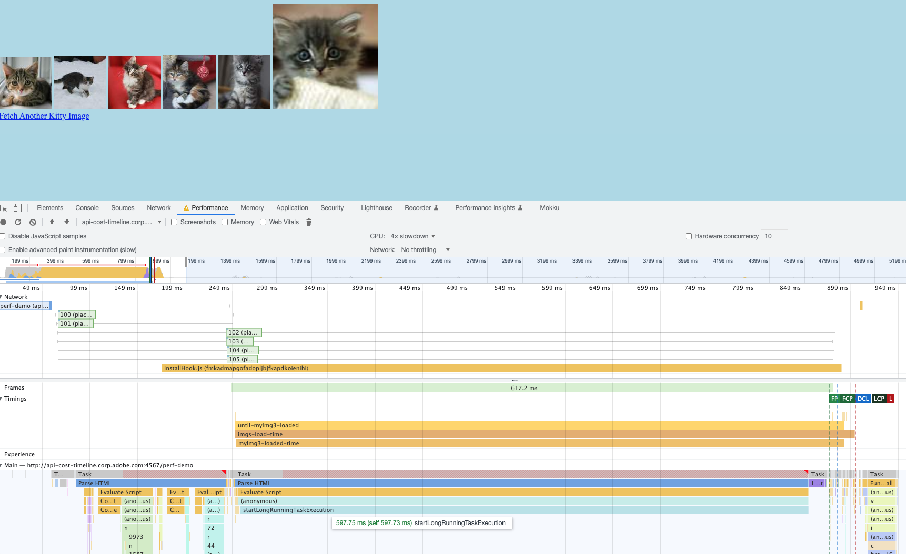

# PerformanceObserver-playground
PerformanceObserver playground

You can open Chrome Devtools to monitoring and profiling the page, also open the console to look at the key perf logs I have printed out:

P.S. Special Thanks to https://placekitten.com/ which provide awesome kitty images!!